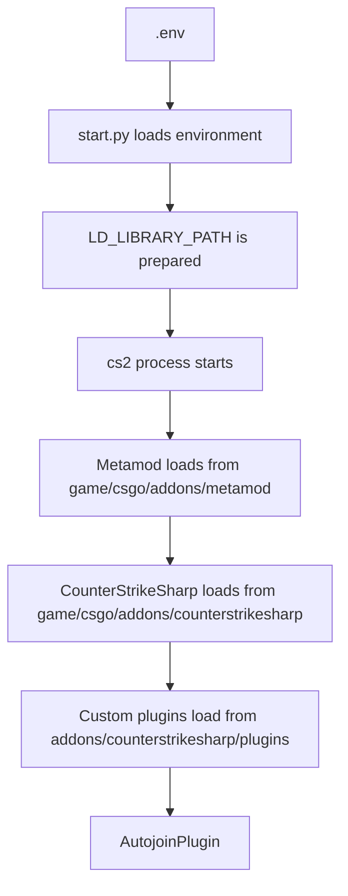
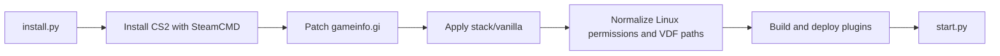

# CS2 Linux Server

Counter-Strike 2 dedicated server for Linux with a local, versioned vanilla mod stack:

- `Metamod:Source`
- `CounterStrikeSharp`

The vanilla stack is stored in-repo under `stack/vanilla/`.
Custom plugins live in `plugins_source/` and are built and deployed automatically.

## Current Baseline

- Metamod: `2.0.0-git1396`
- CounterStrikeSharp: `1.0.367`

Source: [stack/vanilla/VERSIONS.json](./stack/vanilla/VERSIONS.json)

## Repository Layout

```text
cs2-linux-server/
├── stack/vanilla/          # local baseline for Metamod + CounterStrikeSharp
├── plugins_source/         # C# sources for custom plugins
├── scripts/                # install/deploy helpers
├── server/                 # runtime CS2 server install
├── steamcmd/               # SteamCMD client
├── install.py              # full bootstrap
├── setup.py                # reapply local stack + plugins
└── start.py                # start the server
```

## First-Time Install

```bash
python3 install.py
```

This flow:

1. installs system dependencies when available
2. installs SteamCMD if needed
3. installs or updates CS2 into `server/`
4. patches `server/game/csgo/gameinfo.gi`
5. copies `stack/vanilla/addons/` into `server/game/csgo/addons/`
6. normalizes Linux permissions for `.so` files and the embedded `dotnet` host
7. creates `cfg/<EXEC>` if it does not exist
8. builds and deploys custom plugins

## Reapply The Local Stack

```bash
python3 setup.py
```

Use this when:

- the vanilla baseline in `stack/vanilla/` changes
- plugin code in `plugins_source/` changes
- the runtime server must be reconciled with the repository state

## Start The Server

```bash
python3 start.py
```

## Environment Variables

See `.env.example`. Important keys:

- `PORT`
- `IP`
- `TICKRATE`
- `MAXPLAYERS`
- `STEAM_ACCOUNT`
- `RCON_PASSWORD`
- `EXEC`
- `BUILD_PLUGINS`

Example:

- if `EXEC=retake.cfg`, the automation ensures `server/game/csgo/cfg/retake.cfg` exists

## Runtime Flow



## Install And Reconcile Design



## Source Of Truth

- `stack/vanilla/addons/`: local vanilla stack
- `plugins_source/`: custom plugin source code
- `server/game/csgo/addons/`: generated runtime state

Do not treat `server/game/csgo/addons/` as the canonical editable source for the vanilla stack.

## Documentation

- [Docs Hub](./docs/index.md)
- [Overview](./docs/overview.md)
- [Architecture](./docs/architecture.md)
- [Operations](./docs/operations.md)

## Rules

- do not place custom plugins inside `stack/vanilla/`
- do not commit `.env`, tokens, or credentials
- update the vanilla baseline in `stack/vanilla/`
- update plugin behavior in `plugins_source/`
