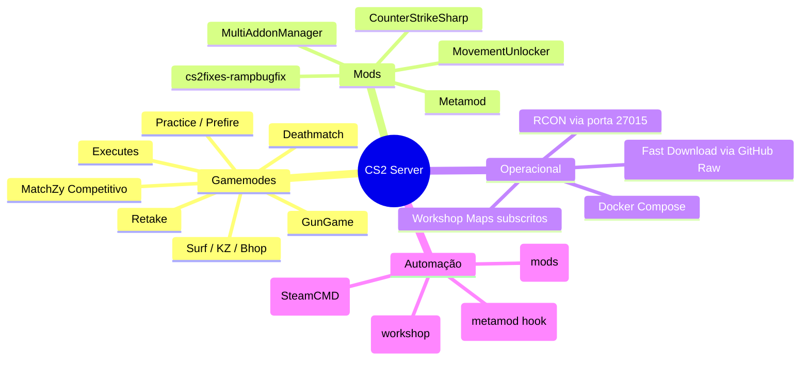

# 01 — Visão Geral

## Propósito

Provisionar um **servidor dedicado CS2** totalmente containerizado, pré-configurado com uma stack de mods (Metamod, CounterStrikeSharp e plugins .NET) e suportando múltiplos gamemodes (Retake, Executes, Deathmatch, Gun Game, Surf, KZ, Bhop, etc.) sem intervenção manual pós-deploy.

## Stack

| Camada           | Tecnologia                                              |
|------------------|---------------------------------------------------------|
| OS base          | Debian Bullseye (32/64-bit libs)                        |
| Runtime de jogo  | CS2 Dedicated Server (AppID `730`)                      |
| Instalação       | SteamCMD (`login anonymous +app_update 730`)            |
| Mod loader       | Metamod Source                                          |
| Framework plugin | CounterStrikeSharp (.NET 8)                             |
| Gerenciador      | Python scripts + Docker Compose                         |
| Config           | `.env` + hierarquia de `.cfg` em `components/csgo/cfg`  |

## Capacidades

## Decisões-chave

- **Overlay via `components/csgo/`**: em cada boot, o conteúdo é copiado por cima de `server/game/csgo/` — permite versionar apenas os artefatos customizados e deixar o restante do jogo sob controle do SteamCMD.
- **`.env` como fonte única**: `start.py` lê o arquivo e exporta variáveis; mesmas chaves usadas pelo `docker-compose.yml`.
- **Gamemode via `EXEC=...`**: o gamemode inicial é selecionado por variável de ambiente (ex: `EXEC=retake.cfg`) e trocado em runtime por `!rcon exec <mode>`.
- **Plugins sob demanda**: todos os plugins CSS ficam em `plugins/disabled/` e são carregados pelo `.cfg` do gamemode ativo — evita conflitos entre modos.
