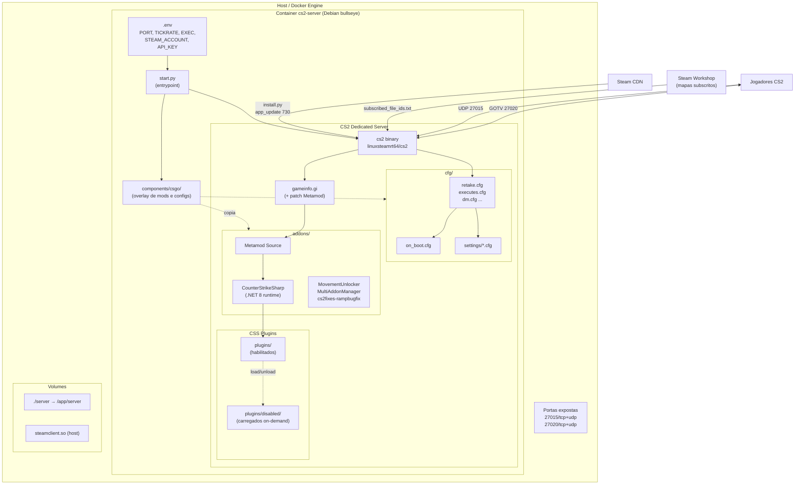
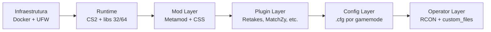
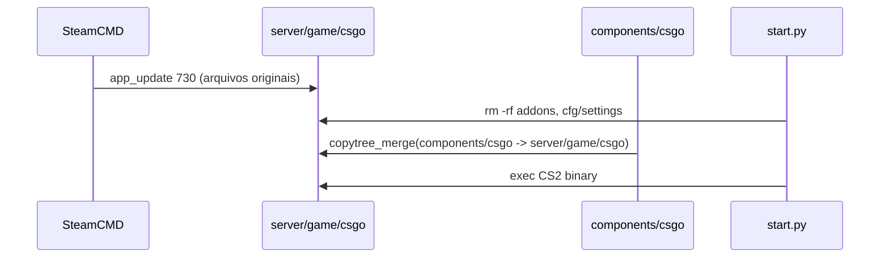

# 02 — Arquitetura

## Diagrama de Componentes

## Camadas Lógicas

| Camada         | Responsabilidade                                    | Arquivos-chave                                |
|----------------|-----------------------------------------------------|-----------------------------------------------|
| Infraestrutura | Container, portas, firewall                         | `Dockerfile`, `docker-compose.yml`, `start.py`|
| Runtime        | Binário CS2 + SteamCMD + libs                       | `install.py`, `server/game/bin/.../cs2`       |
| Mod            | Hook Metamod em `gameinfo.gi`; bootstrap do CSS     | `addons/metamod`, `addons/counterstrikesharp` |
| Plugin         | Lógica de gamemode (Retakes, Executes, MatchZy...)  | `addons/counterstrikesharp/plugins/`          |
| Config         | Parâmetros do servidor por modo                     | `cfg/<mode>.cfg`, `cfg/settings/*.cfg`        |
| Operator       | Overrides e troca de modo em runtime                | `custom_files/`, RCON `!rcon exec <mode>`     |

## Princípio do Overlay

O diretório `components/csgo/` **não é** o servidor — é um pacote de artefatos que é copiado sobre `server/game/csgo/` a cada boot. Isso permite:

1. Versionar no git **apenas** o que é custom (addons, configs, map groups).
2. Re-sincronizar sempre que o SteamCMD atualiza o jogo e sobrescreve arquivos.
3. Manter `addons/` e `cfg/settings/` limpos antes da cópia (o `start.py` faz `rm -rf` desses diretórios antes de recopiar).

