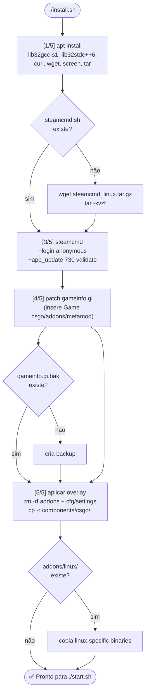
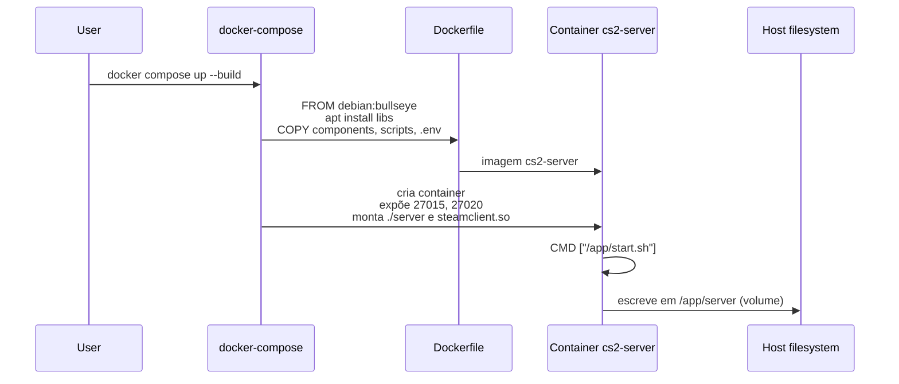
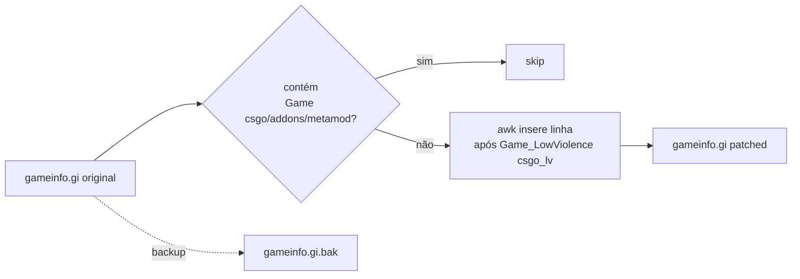

# 03 — Fluxo de Instalação

Há tres caminhos suportados: **instalação direta no host Linux** (`install.sh`), **instalação local no Windows** (`install.ps1`) e **container Docker** (`docker compose up --build`). Todos convergem no mesmo layout de arquivos.

## Instalação Local (`install.sh`)

### Etapas-chave

| Etapa | O que faz                                              | Por quê                                                |
|-------|--------------------------------------------------------|--------------------------------------------------------|
| 1     | Instala libs de 32-bit                                 | SteamCMD e algumas libs do CS2 precisam delas          |
| 2     | Baixa SteamCMD em `./steamcmd/`                        | Gerenciador oficial de downloads de apps Steam         |
| 3     | `app_update 730 validate` em `./server/`               | Baixa o servidor dedicado (anônimo)                    |
| 4     | Patch em `gameinfo.gi` inserindo entrada do Metamod    | Sem isso, o jogo não carrega o loader de plugins       |
| 5     | Overlay: limpa `addons/` + `cfg/settings/` e recopia   | Garante estado determinístico dos mods                 |

## Instalação via Docker

### docker-compose.yml — pontos relevantes

- **`env_file: .env`** — injeta as mesmas variáveis que `start.sh` consome.
- **`ports`** — 27015 (jogo/RCON) e 27020 (GOTV) em TCP e UDP.
- **`volumes`**:
  - `./server:/app/server` — persiste o download do SteamCMD fora do container.
  - `steamclient.so` — bind mount do host para satisfazer a dependência dinâmica do binário.

## Instalação Local no Windows (`install.ps1`)

Fluxo resumido:

1. Carrega `.env` se existir e respeita `CS2_PATH` quando informado.
2. Instala `steamcmd.exe` em `.\steamcmd\` se necessário.
3. Procura uma instalacao existente em `CS2_PATH`, em `.\server\` ou nas bibliotecas Steam do Windows.
4. Se encontrar, cria `server/` como junction para a pasta existente; se nao encontrar, executa `+app_update 730`.
5. Aplica o patch de `gameinfo.gi` e copia `components/csgo/` com overlay de `addons/windows/`.

Esse fluxo evita baixar tudo de novo quando o host ja possui o CS2 instalado em outra pasta.
Quando uma pasta existente e reaproveitada, o patch do Metamod e os arquivos do overlay passam a ser aplicados nela atraves da junction `server/`.

## Patch do `gameinfo.gi`

Sem essa linha, Metamod não é carregado e, por consequência, CounterStrikeSharp (que roda como plugin do Metamod) também não.

## Setup remoto alternativo (`setup.sh`)

`setup.sh` é um instalador **pull-based** que baixa artefatos do repositório [`kus/cs2-modded-server`](https://github.com/kus/cs2-modded-server) — usado para aprovisionar rapidamente uma VM nova. Ele:

1. Baixa `stop.sh` e `start.sh` via curl direto do GitHub.
2. Resolve IP público com OpenDNS.
3. Instala SteamCMD em `/steamcmd` com symlinks para `~/.steam/sdk32/` e `~/.steam/sdk64/`.
4. `app_update 730` em `~/cs2_server`.
5. Baixa o zip do mod, mescla `custom_files/` sobre `game/csgo/`.
6. Aplica patch do Metamod e inicia o servidor.

> Use `install.sh` para instalações baseadas neste repositório; `setup.sh` é utilitário para reprovisão rápida com o fork original.
