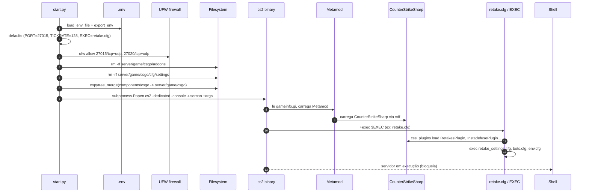
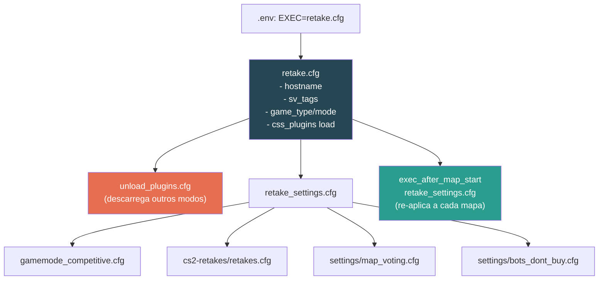
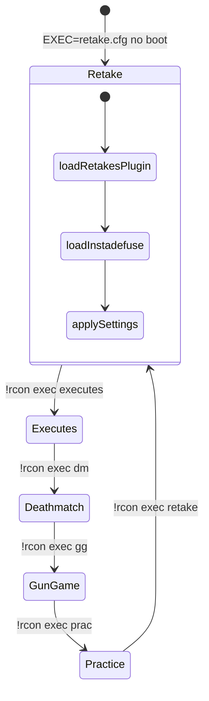

# 04 — Fluxo de Runtime

## `start.py` — Sequência de Boot



## Argumentos passados ao binário

```bash
cs2 -dedicated -console -usercon \
    +game_type 0 +game_mode 0 +mapgroup mg_active +map de_mirage \
    -port $PORT -ip $IP +net_public_adr $IP \
    -tickrate $TICKRATE +sv_visiblemaxplayers $MAXPLAYERS \
    -authkey $API_KEY +sv_setsteamaccount $STEAM_ACCOUNT \
    +sv_lan $LAN +sv_password $SERVER_PASSWORD +rcon_password $RCON_PASSWORD \
    +exec $EXEC
```

| Flag                        | Origem / função                                        |
|-----------------------------|--------------------------------------------------------|
| `-dedicated -console`       | Modo dedicated sem GUI                                 |
| `-usercon`                  | Permite RCON externo                                   |
| `-authkey`                  | Game Server Login Token (Steam Web API Key)            |
| `+sv_setsteamaccount`       | GSLT da conta Steam (obrigatório em partidas públicas) |
| `+exec $EXEC`               | Gamemode inicial (define hostname, plugins, regras)    |
| `+map de_mirage`            | Mapa placeholder até o `.cfg` trocar via mapgroup      |

## Cadeia de execução de configs



## Troca de gamemode em runtime



Cada `<modo>.cfg` começa com `exec unload_plugins.cfg`, que descarrega plugins de modos anteriores para evitar colisões (ex: `RetakesPlugin` interferindo com `MatchZy`). Em seguida, carrega explicitamente os DLLs do modo alvo a partir de `plugins/disabled/`.

## Ciclo por mapa

O `exec_after_map_start` (provido pelo plugin `CS2_ExecAfter`) reexecuta o `_settings.cfg` do modo a cada troca de mapa, garantindo que cvars sensíveis à persistência (`mp_roundtime`, `sv_cheats`, etc.) sejam reaplicados.

## Observabilidade mínima

- `log on` / `sv_logecho 1` — habilitam logs textuais (desabilitados por padrão em `server.cfg`).
- `writeid` / `writeip` — persistem listas de banimento após boot.
- **RCON** (porta 27015 TCP) — único canal administrativo remoto.
