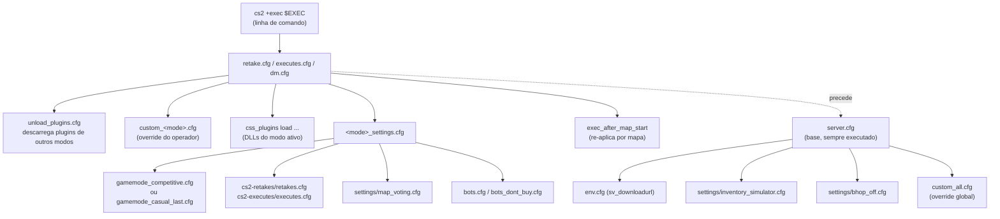
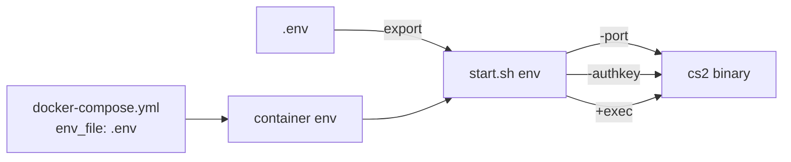

# 05 — Sistema de Configuração

## Hierarquia de `.cfg`



## Arquivos relevantes em `components/csgo/cfg/`

| Arquivo                      | Papel                                                           |
|------------------------------|-----------------------------------------------------------------|
| `server.cfg`                 | Base executada pelo engine em todo boot; reseta cvars voláteis  |
| `env.cfg`                    | Define `sv_downloadurl` (fast download via GitHub raw)          |
| `on_boot.cfg`                | Slot para operador rodar comandos no boot                       |
| `unload_plugins.cfg`         | Lista `css_plugins unload` de todos os modos                    |
| `<mode>.cfg`                 | Define hostname, sv_tags, plugins, gamemode (1 por modo)        |
| `<mode>_settings.cfg`        | Detalhes finos do modo (mp_*, sv_*)                             |
| `bots.cfg`                   | Configuração de bots                                            |
| `mods.cfg`                   | Mensagens in-chat listando comandos `!rcon exec`                |
| `settings/*.cfg`             | Snippets reutilizáveis (map voting, bhop on/off, etc.)          |
| `cs2-retakes/retakes.cfg`    | Cvars do plugin Retakes                                         |
| `cs2-executes/executes.cfg`  | Cvars do plugin Executes                                        |
| `MatchZy/`, `SharpTimer/`    | Configs de plugins específicos                                  |

## Variáveis de ambiente (`.env`)

```env
PORT=27015               # porta UDP/TCP do servidor
IP=0.0.0.0               # bind address
TICKRATE=128             # 64 ou 128
MAXPLAYERS=16            # sv_visiblemaxplayers
LAN=0                    # 1 para modo LAN (sem GSLT)
STEAM_ACCOUNT=""         # GSLT (https://steamcommunity.com/dev/managegameservers)
API_KEY=""               # Steam Web API key
SERVER_PASSWORD=""       # senha do servidor (vazio = público)
RCON_PASSWORD=1234567    # altere em produção
EXEC=retake.cfg          # gamemode inicial
```



## Gamemodes disponíveis (via `!rcon exec <name>`)

Extraído de `mods.cfg`:

| Comando            | Modo                                    |
|--------------------|-----------------------------------------|
| `!rcon exec retake`| Retakes (padrão deste repo)             |
| `!rcon exec executes` | Executes                             |
| `!rcon exec comp`  | Competitivo (MatchZy)                   |
| `!rcon exec dm`    | Deathmatch (plugin)                     |
| `!rcon exec dm-valve` | Deathmatch oficial Valve             |
| `!rcon exec gg`    | Gun Game                                |
| `!rcon exec ar`    | Arms Race (Valve)                       |
| `!rcon exec awp`   | AWP only                                |
| `!rcon exec prac`  | Practice (nades, lineups)               |
| `!rcon exec prefire` | Prefire practice                      |
| `!rcon exec bhop` / `surf` / `kz` / `course` | Skill maps         |
| `!rcon exec battle` / `br` / `hns` / `scoutzknivez` / `soccer` / `minigames` / `deathrun` / `oitc` / `1v1` / `wingman` / `45` / `casual-1.6` | Modos alternativos |

## Overrides do operador

Arquivos começando com `custom_` são pontos de extensão:

- `custom_all.cfg` — sempre executado após `server.cfg`.
- `custom_<mode>.cfg` — executado dentro do `.cfg` do modo.

A pasta `custom_files_example/` mostra o layout esperado. Em produção, coloque seu conteúdo em `custom_files/` e deixe o `setup.sh` fazer o merge.

## `gamemodes_server.txt`

Define os mapgroups (`mg_retake`, `mg_executes`, `mg_surf`, etc.) e os mapas/workshop IDs incluídos em cada um. Consumido pelo engine e pelo `add-map.py` (ver [07](./07-scripts.md)).

## `subscribed_file_ids.txt`

Lista de 148+ workshop IDs que o CS2 baixa automaticamente no boot (via `host_workshop_collection` ou similar). Essa é a fonte primária do catálogo de mapas custom do servidor.
