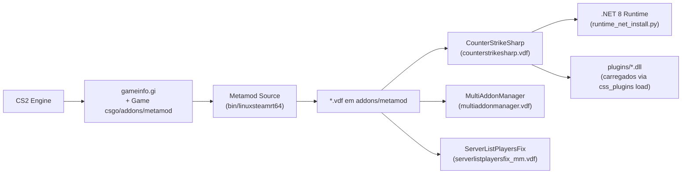
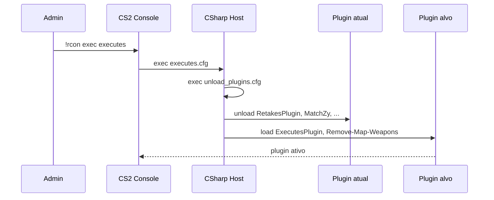

# 06 — Addons e Plugins

## Cadeia de carregamento



## Metamod Source

Loader nativo que intercepta a inicialização do CS2 e publica uma API C++ para plugins. Instalado em `addons/metamod/` com VDFs declarando os plugins secundários.

### VDFs presentes

| VDF                               | Plugin associado                            |
|-----------------------------------|---------------------------------------------|
| `counterstrikesharp.vdf`          | CounterStrikeSharp (framework .NET)         |
| `multiaddonmanager.vdf`           | MultiAddonManager (addons dinâmicos)        |
| `serverlistplayersfix_mm.vdf`     | Fix para listagem de players                |

## CounterStrikeSharp (CSS)

Framework que carrega plugins escritos em C# (.NET 8). Este repo já inclui uma seleção grande em `addons/counterstrikesharp/plugins/`:

### Plugins ativos por padrão

```
CS2-CustomVotes
CS2AnnouncementBroadcaster
CS2Rcon
CS2_ExecAfter
FixRandomSpawn
GameModeManager
InventorySimulator
MapConfigurator
RetakesAllocator
SimpleAdmin
WASDMenuAPI
```

### Plugins em `plugins/disabled/` (carregados on-demand)

```
Advertisement, CS2-Remove-Map-Weapons, Deathmatch, DeathrunManager,
ExecutesPlugin, FunMatchPlugin, GG2, GameModifiers, InstadefusePlugin,
K4-Arenas, K4-DamageInfo, K4ryuuDamageInfo, MatchZy, MutualScoringPlayers,
OpenPrefirePrac, RetakesAllocator, RetakesPlugin, RollTheDice, STFixes,
SharpTimer, WarcraftPlugin, WhiteList, cs2-OneInTheChamber,
cs2-advanced-weapon-system
```

## Modelo load/unload dinâmico



Esse padrão (**"todos desativados, só o modo ativo carrega"**) permite trocar de modo em runtime sem reboot, mantendo apenas os plugins do modo corrente residentes — reduz memória e evita conflitos.

## Outros addons nativos

| Diretório                   | O que é                                           |
|-----------------------------|---------------------------------------------------|
| `MovementUnlocker`          | Remove restrições de movimento do CS2 engine      |
| `cs2fixes-rampbugfix`       | Patch para bugs de rampa                          |
| `multiaddonmanager`         | Gerencia múltiplos Workshop addons simultâneos    |
| `serverlistplayersfix_mm`   | Fix para contagem de players no browser           |
| `scripts/`                  | Scripts de jogo Valve (não relacionado a scripts/ raiz) |

## Runtime .NET

O CSS exige **.NET 8**; para instalar no host:

```bash
sudo python3 runtime_net_install.py   # adiciona repo MS + instala dotnet-runtime-8.0
```

No Docker, o runtime vem embarcado no diretório `addons/counterstrikesharp/dotnet/`.

## Plugins — mapa por modo

| Modo      | Plugins ativados                                                          |
|-----------|---------------------------------------------------------------------------|
| Retake    | RetakesPlugin, InstadefusePlugin, RetakesAllocator, CS2-Remove-Map-Weapons, MutualScoringPlayers |
| Executes  | ExecutesPlugin, CS2-Remove-Map-Weapons, MutualScoringPlayers              |
| MatchZy   | MatchZy (descarrega CS2Rcon)                                              |
| Deathmatch| Deathmatch (core)                                                         |
| GunGame   | GG2 ou CS2_GunGame                                                        |
| Surf/KZ/Bhop | SharpTimer + ST-Fixes                                                  |
| Practice  | OpenPrefirePrac (no modo prefire)                                         |
