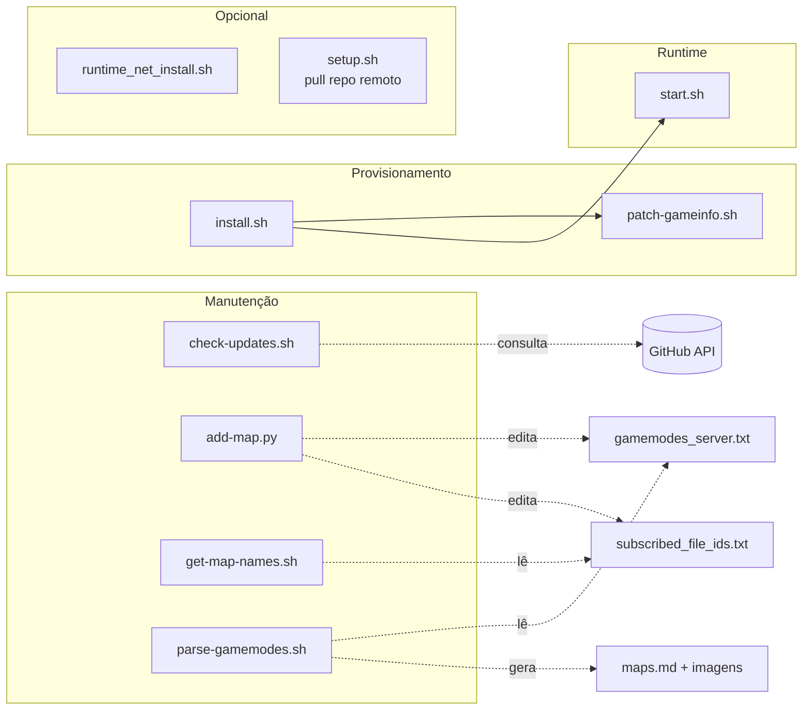
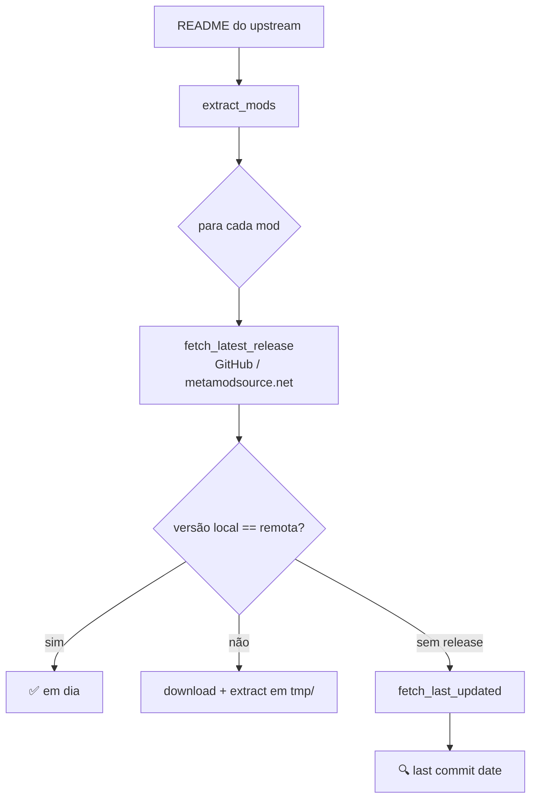

# 07 — Scripts Utilitários



## `scripts/add-map.py`

**Objetivo:** inserir um mapa em um `mapgroup` de `gamemodes_server.txt` e, opcionalmente, adicionar o workshop ID a `subscribed_file_ids.txt`.

```bash
python scripts/add-map.py mg_aim aim_ak-colt_CS2 3078701726
# ou contra custom_files/
python scripts/add-map.py mg_aim aim_ak-colt_CS2 3078701726 --custom
```

Parsing é textual (linha a linha) e respeita a indentação com tabs do arquivo Valve KV.

## `scripts/check-updates.sh`

Lê a seção "Mod | Version | Why" do README do repo upstream (`kus/cs2-modded-server`), extrai a versão embutida no repo local e compara com a última release no GitHub. Para cada mod:



Saída colorida: `✅` (em dia), `📦` (update disponível), `🔍` (repo sem releases), `🚫` (não consegue determinar).

## `scripts/get-map-names.sh`

Para cada workshop ID em `subscribed_file_ids.txt`, roda `steamcmd +download_item 730 <id>`, extrai o `.vpk` com o utilitário Python `vpk` e lista os arquivos `maps/*.vpk` que aquele workshop publica. Usado para descobrir o nome real do mapa para colocar em `gamemodes_server.txt`.

Requisitos: `steamcmd/steamcmd.sh` no cwd e `pip install vpk`.

## `scripts/patch-gameinfo.sh`

Versão standalone do patch que `install.sh` aplica. Insere:

```
Game    csgo/addons/metamod
```

após `Game_LowViolence csgo_lv` em `game/csgo/gameinfo.gi`, se ainda não existir. Idempotente.

## `scripts/parse-gamemodes.sh`

Varre `gamemodes_server.txt`, para cada mapgroup gera markdown em `maps.md` com imagens do Workshop, baixa thumbnails de `steamcommunity.com/sharedfiles/filedetails/?id=<id>`, comprime com `ffmpeg` para `compressed_maps/`. Ferramenta de documentação visual dos mapas do servidor.

## `runtime_net_install.sh`

Instalador do runtime **.NET 8.0** para hosts baseados em Ubuntu/Debian via repo da Microsoft. Necessário para CounterStrikeSharp quando **não** se usa Docker.

## `setup.sh`

Alternativo ao `install.sh`: provisiona uma VM do zero baixando direto do repo `kus/cs2-modded-server` (ver [03](./03-install-flow.md)).

## Matriz de uso

| Cenário                                | Scripts a executar                          |
|----------------------------------------|---------------------------------------------|
| Primeiro boot (host Linux local)       | `install.sh` → `start.sh`                   |
| Primeiro boot (Docker)                 | `docker compose up --build`                 |
| Host Linux com .NET faltando           | `runtime_net_install.sh` antes do start     |
| Adicionar mapa do workshop             | `add-map.py <group> <name> <id> --custom`   |
| Descobrir nome real de um workshop ID  | `get-map-names.sh`                          |
| Verificar updates dos mods             | `check-updates.sh`                          |
| Gerar docs de mapas do servidor        | `parse-gamemodes.sh`                        |
| Reaplicar patch Metamod após update CS2| `patch-gameinfo.sh`                         |
