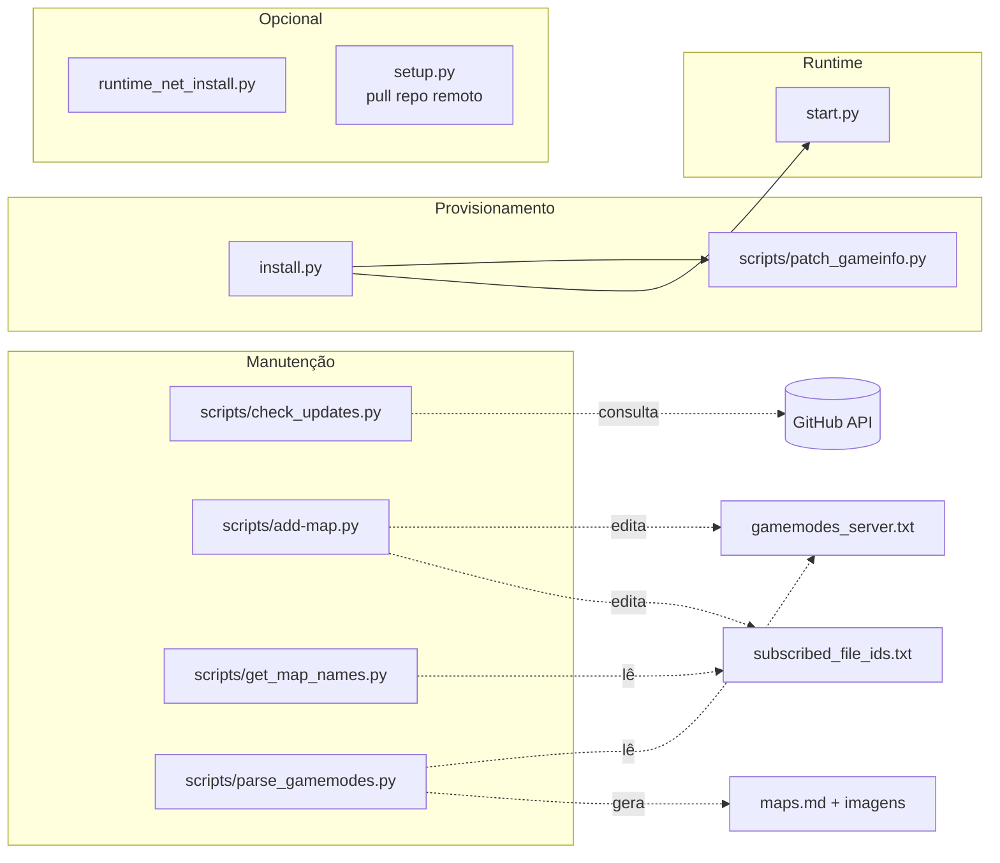
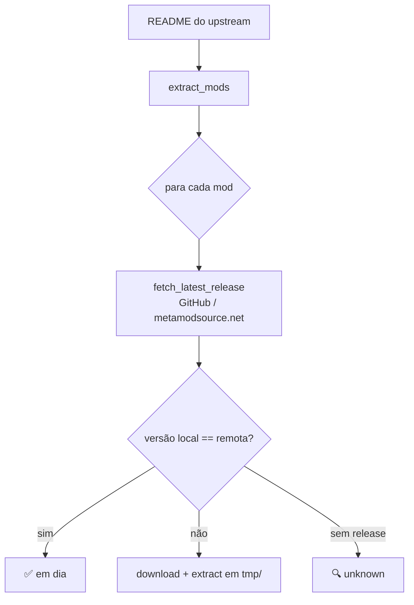

# 07 — Scripts Utilitários



## `scripts/add-map.py`

**Objetivo:** inserir um mapa em um `mapgroup` de `gamemodes_server.txt` e, opcionalmente, adicionar o workshop ID a `subscribed_file_ids.txt`.

```bash
python3 scripts/add-map.py mg_aim aim_ak-colt_CS2 3078701726
# ou contra custom_files/
python3 scripts/add-map.py mg_aim aim_ak-colt_CS2 3078701726 --custom
```

Parsing é textual (linha a linha) e respeita a indentação com tabs do arquivo Valve KV.

## `scripts/check_updates.py`

Lê a seção "Mod | Version | Why" do README do repo upstream (`kus/cs2-modded-server`), extrai a versão embutida no repo local e compara com a última release no GitHub. Para cada mod:



Saída colorida: `OK` (em dia), `INFO` (update disponível), `WARN` (não consegue determinar).

```bash
python3 scripts/check_updates.py
```

## `scripts/get_map_names.py`

Para cada workshop ID em `subscribed_file_ids.txt`, roda `steamcmd +download_item 730 <id>`, extrai o `.vpk` com o utilitário Python `vpk` e lista os arquivos `maps/*.vpk` que aquele workshop publica. Usado para descobrir o nome real do mapa para colocar em `gamemodes_server.txt`.

Requisitos: `steamcmd/steamcmd.sh` instalado (`python3 install.py`) e `pip install vpk`.

```bash
python3 scripts/get_map_names.py
```

## `scripts/patch_gameinfo.py`

Versão standalone do patch que `install.py` aplica. Insere:

```
Game    csgo/addons/metamod
```

após `Game_LowViolence csgo_lv` em `game/csgo/gameinfo.gi`, se ainda não existir. Idempotente.

```bash
python3 scripts/patch_gameinfo.py
# ou apontando para um path específico:
python3 scripts/patch_gameinfo.py /caminho/para/gameinfo.gi
```

## `scripts/parse_gamemodes.py`

Varre `gamemodes_server.txt`, para cada mapgroup gera markdown em `maps.md` com imagens do Workshop, baixa thumbnails de `steamcommunity.com/sharedfiles/filedetails/?id=<id>`, comprime com `ffmpeg` para `compressed_maps/`. Ferramenta de documentação visual dos mapas do servidor.

```bash
python3 scripts/parse_gamemodes.py
```

## `runtime_net_install.py`

Instalador do runtime **.NET 8.0** para hosts baseados em Ubuntu/Debian via repo da Microsoft. Necessário para CounterStrikeSharp quando **não** se usa Docker.

```bash
sudo python3 runtime_net_install.py
```

## `setup.py`

Alternativo ao `install.py`: provisiona uma VM do zero baixando direto do repo `kus/cs2-modded-server` (ver [03](./03-install-flow.md)).

## Matriz de uso

| Cenário                                | Scripts a executar                                      |
|----------------------------------------|---------------------------------------------------------|
| Primeiro boot (host Linux local)       | `python3 install.py` → `python3 start.py`               |
| Primeiro boot (Docker)                 | `docker compose up --build`                             |
| Host Linux com .NET faltando           | `sudo python3 runtime_net_install.py` antes do start    |
| Adicionar mapa do workshop             | `python3 scripts/add-map.py <group> <name> <id>`        |
| Descobrir nome real de um workshop ID  | `python3 scripts/get_map_names.py`                      |
| Verificar updates dos mods             | `python3 scripts/check_updates.py`                      |
| Gerar docs de mapas do servidor        | `python3 scripts/parse_gamemodes.py`                    |
| Reaplicar patch Metamod após update CS2| `python3 scripts/patch_gameinfo.py`                     |
