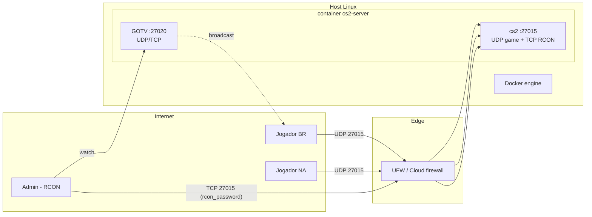
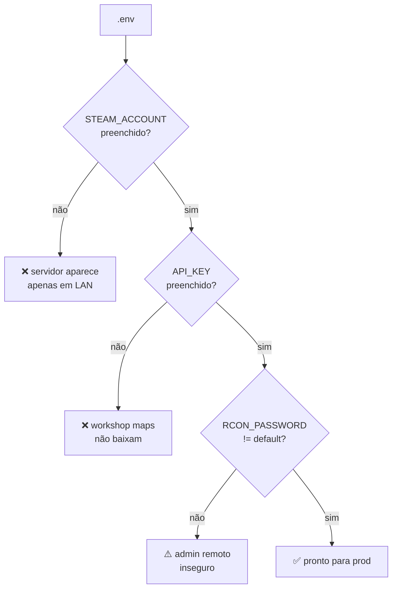
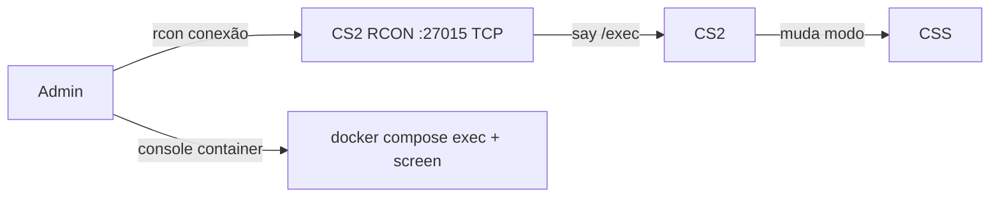
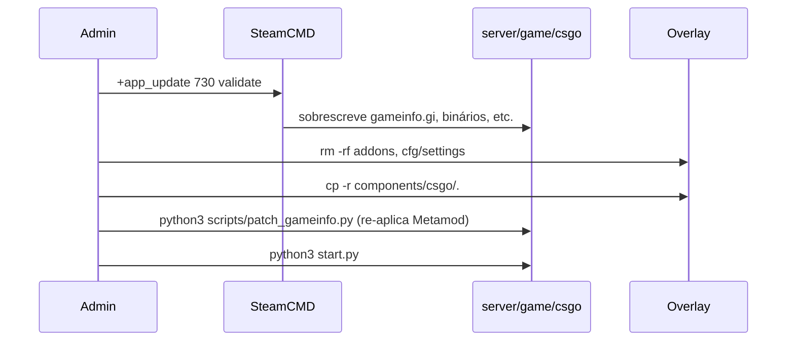

# 08 — Deploy e Operação

## Topologia de rede



## Portas

| Porta   | Proto     | Uso                                 |
|---------|-----------|-------------------------------------|
| 27015   | UDP       | Conexão de jogo dos clientes        |
| 27015   | TCP       | RCON (requer `-usercon`)            |
| 27020   | UDP/TCP   | GOTV (SourceTV) — atualmente desabilitado em `server.cfg` via `tv_enable 0` |

## Deploy via Docker

```bash
cp .env.example .env
# edite STEAM_ACCOUNT, API_KEY, RCON_PASSWORD, EXEC
docker compose up -d --build
docker compose logs -f cs2
```

Para parar: `docker compose down`.

Volume `./server` persiste a instalação do CS2 entre restarts — evita baixar 30GB+ toda vez.

## Deploy em host Linux

```bash
sudo python3 runtime_net_install.py   # se necessário
python3 install.py                    # instala CS2 + patch gameinfo
python3 start.py                      # foreground
# ou em screen / systemd
screen -dmS cs2 python3 start.py
```

### Template systemd (exemplo)

```ini
[Unit]
Description=CS2 Dedicated Server
After=network-online.target

[Service]
Type=simple
User=steam
WorkingDirectory=/opt/cs2-linux-server
ExecStart=/usr/bin/python3 /opt/cs2-linux-server/start.py
Restart=on-failure
RestartSec=10

[Install]
WantedBy=multi-user.target
```

> Template apenas — ajuste usuário, caminhos e permissões antes de usar.

## Variáveis obrigatórias



| Chave              | Onde obter                                                         |
|--------------------|--------------------------------------------------------------------|
| `STEAM_ACCOUNT`    | https://steamcommunity.com/dev/managegameservers (GSLT, AppID 730) |
| `API_KEY`          | https://steamcommunity.com/dev/apikey                              |
| `RCON_PASSWORD`    | Defina você — sempre troque do default `1234567`                   |

## Operação em runtime



Via RCON (cliente do próprio jogo ou `rcon-cli`):

```
rcon_password 1234567
rcon exec retake       # troca gamemode
rcon changelevel de_mirage
rcon css_plugins list
rcon status
```

Via chat no jogo (se `CS2Rcon` plugin estiver ativo):
```
!rcon exec dm
!rcon changelevel de_dust2
```

## Troubleshooting

| Sintoma                                      | Causa provável                                    | Ação                                                |
|----------------------------------------------|---------------------------------------------------|-----------------------------------------------------|
| "Could not load Metamod"                     | `gameinfo.gi` sem patch                           | Rodar `python3 scripts/patch_gameinfo.py`           |
| CSS plugins não carregam                     | .NET runtime ausente                              | `python3 runtime_net_install.py` ou usar Docker     |
| Servidor não aparece no browser              | `STEAM_ACCOUNT` vazio ou inválido                 | Gerar GSLT válido para AppID 730                    |
| Workshop maps faltando                       | `API_KEY` ausente ou `subscribed_file_ids.txt` dessincronizado | Preencher API_KEY, rodar `python3 scripts/get_map_names.py` |
| RCON rejeitado                               | porta 27015/TCP bloqueada ou senha errada         | Verificar UFW + `RCON_PASSWORD`                     |
| `steamclient.so: cannot open`                | volume do docker-compose apontando para caminho inexistente no host | Criar symlink ou ajustar o volume     |
| Servidor em hibernação                       | `sv_hibernate_when_empty` foi reativado           | `server.cfg` força `0`; reexecutar exec do modo     |

## Atualização do CS2 (Valve)



Após cada update oficial da Valve, `gameinfo.gi` pode ter sido **regravado** — rode `python3 scripts/patch_gameinfo.py` antes de levantar o servidor.

## Segurança operacional

- **Nunca** commite `.env` (já está em `.gitignore`).
- Altere `RCON_PASSWORD` do default antes de expor à internet.
- Em produção, considere:
  - RCON acessível apenas via VPN ou firewall allow-list.
  - `sv_password` para servidores privados.
  - Plugin `WhiteList` (está em `plugins/disabled/`) para restrição por SteamID.
  - Plugin `SimpleAdmin` para gestão granular de permissões.
