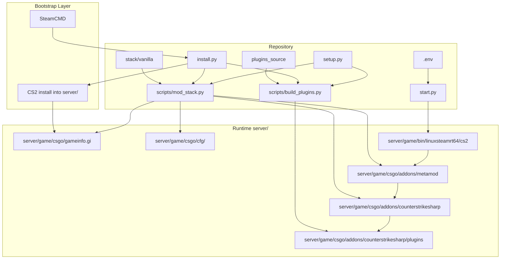
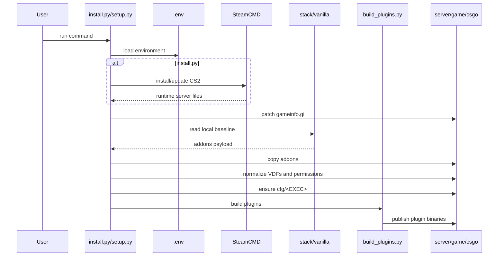

# Architecture

## System Design

## Responsibilities

### `stack/vanilla/`

Maintains the local baseline for:

- Metamod
- CounterStrikeSharp

### `plugins_source/`

Maintains custom plugin source code.

### `scripts/mod_stack.py`

Responsible for:

- patching `gameinfo.gi`
- applying the local stack
- fixing Linux permissions
- normalizing standard Metamod VDF/runtime files
- creating `cfg/<EXEC>`
- validating expected runtime files

### `scripts/build_plugins.py`

Responsible for:

- restore
- build
- deploy of custom plugins

### `install.py`

Responsible for the full bootstrap flow.

### `setup.py`

Responsible for reapplying the local baseline without reinstalling the game server.

### `start.py`

Responsible for starting the CS2 server process with the expected environment.

## Deployment Sequence

## Healthy Runtime State

A healthy boot should show:

1. Metamod loaded
2. CounterStrikeSharp initialized
3. `AutojoinPlugin` loaded

After that point, remaining failures are usually related to:

- networking
- port binding
- Steam account token
- general server configuration
