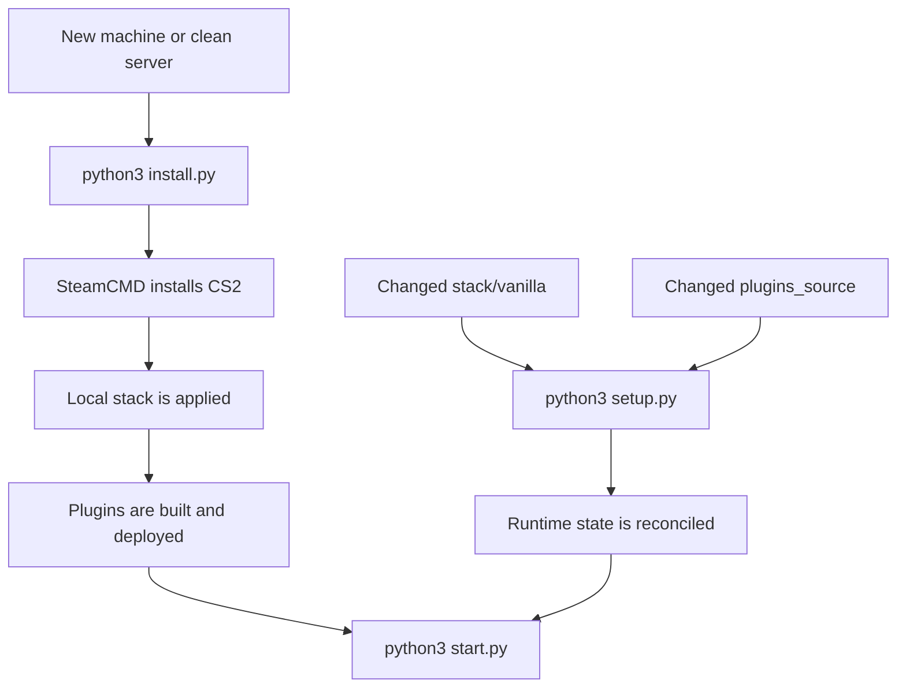

# Operations

## First-Time Install

```bash
python3 install.py
```

Expected result:

- CS2 installed in `server/`
- `gameinfo.gi` patched
- Metamod and CounterStrikeSharp copied from `stack/vanilla/`
- Linux permissions normalized for `.so` and embedded runtime files
- custom plugin built and deployed

## Reapply The Baseline

```bash
python3 setup.py
```

Use this when:

- the vanilla baseline changes
- plugin code changes
- the runtime state diverges from the repository

## Start The Server

```bash
python3 start.py
```

## Troubleshooting

### Plugin does not load

Check for these lines in boot logs:

- `CSSharp: CounterStrikeSharp.API Loaded Successfully`
- `Loading plugin AutojoinPlugin`
- `Finished loading plugin AutojoinPlugin`

If they are missing:

1. run `python3 setup.py`
2. validate `server/game/csgo/addons/`
3. validate the plugin deploy under `server/game/csgo/addons/counterstrikesharp/plugins/`

### Metamod or CounterStrikeSharp do not load

Verify:

- `server/game/csgo/gameinfo.gi`
- `server/game/csgo/addons/metamod`
- `server/game/csgo/addons/counterstrikesharp`
- permissions on `.so` files and the embedded `dotnet` host
- standard VDF contents in `addons/metamod/`

### Boot fails after plugins load

If Metamod, CounterStrikeSharp, and the plugin already loaded, the remaining issue is usually not the mod stack.

Check:

- port binding
- `STEAM_ACCOUNT`
- `IP`
- `PORT`
- `EXEC`

## Operational Flow



## Good Practices

- edit the vanilla stack in `stack/vanilla/`
- edit plugins in `plugins_source/`
- do not use `server/game/csgo/addons/` as the primary editable source
- use `setup.py` to reconcile runtime with the repository
