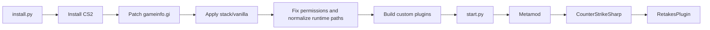

# Overview

## Goal

This repository delivers a CS2 server with:

- automated installation
- a local, versioned vanilla mod stack
- custom plugins built from source

## Core Concepts

### Vanilla Stack

The vanilla stack is the content of:

- `stack/vanilla/addons/metamod`
- `stack/vanilla/addons/counterstrikesharp`

That content is copied into the runtime server during `install.py` and `setup.py`.

### Custom Plugins

Custom plugins are not stored inside the vanilla baseline.

They live in:

- `plugins_source/`

And are published to:

- `server/game/csgo/addons/counterstrikesharp/plugins/`

## Main Flow

## Important Directories

- `stack/vanilla/`: local stack baseline
- `plugins_source/`: plugin sources
- `scripts/`: automation
- `server/`: installed runtime

## Important Files

- `install.py`: first-time bootstrap
- `setup.py`: reapply baseline and plugins
- `start.py`: launch the server
- `scripts/mod_stack.py`: patch `gameinfo.gi`, copy stack, normalize paths, fix permissions
