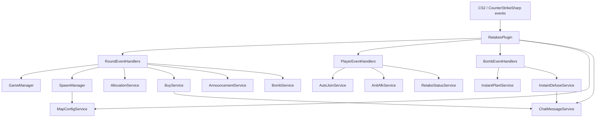
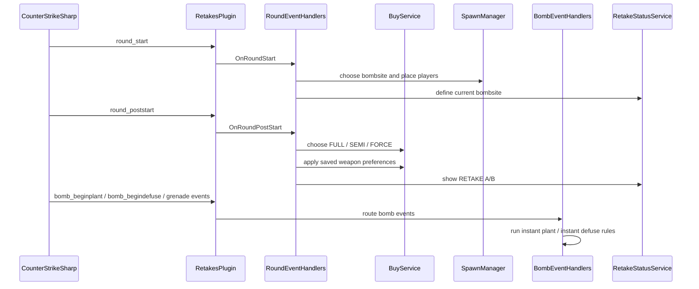

# Retakes Plugin

## Goal

`RetakesPlugin` is the central gameplay plugin for this server.

It owns:

- queue and team flow
- bombsite selection
- spawn allocation
- buy/loadout logic
- AWP queue
- instant plant
- instant defuse
- retake HUD (`RETAKE A/B`)
- autojoin and bot reconcile
- anti-AFK
- spawn editor and map config management

## Source Of Truth

- source: `plugins_source/cs2-retakes/`
- runtime plugin: `server/game/csgo/addons/counterstrikesharp/plugins/RetakesPlugin/`
- CSS config: `server/game/csgo/addons/counterstrikesharp/configs/plugins/RetakesPlugin/RetakesPlugin.json`

Runtime data generated by the plugin:

- `buy_preferences.json` in the plugin directory
- `map_config/<map>.json` in the plugin directory

## System Design

## Round Flow

## Main Modules

### Entry Point

- `RetakesPlugin.cs`
  Coordinates service initialization, event registration, command registration, buy window state, AWP state, and plugin-level orchestration.

### Event Layer

- `RoundEventHandlers.cs`
  Controls round lifecycle, bombsite choice, spawn distribution, fallback allocation, autoplant trigger, and round reset.
- `PlayerEventHandlers.cs`
  Controls connect, spawn, death, team change, disconnect, autojoin, anti-AFK, and retake HUD trigger.
- `BombEventHandlers.cs`
  Central adapter for bomb and grenade events. Keeps instant plant/defuse isolated from round logic.

### Managers

- `GameManager.cs`
  Owns round-facing game state and player scoring.
- `QueueManager.cs`
  Owns active players, queue priority, team balancing, and spectator flow.
- `SpawnManager.cs`
  Selects and applies T/CT spawns from per-map config.
- `BreakerManager.cs`
  Opens doors and breaks props when enabled.

### Services

- `MapConfigService.cs`
  Loads and persists `map_config/<map>.json`.
- `SpawnService.cs`
  Renders spawn helpers used by the editor commands.
- `BuyService.cs`
  Chooses round economy type, exposes the buy menu flow, persists weapon preferences, and validates allowed weapons.
- `AllocationService.cs`
  Gives weapons, armor, grenades, and defuse kit.
- `InstantPlantService.cs`
  Applies instant plant only when enabled and when autoplant is not already handling the round.
- `InstantDefuseService.cs`
  Applies instant defuse only when all terrorists are dead and no grenade threat is active near the bomb.
- `RetakeStatusService.cs`
  Renders the HTML HUD `RETAKE A/B` once per player per round token.
- `AnnouncementService.cs`
  Handles chat, center, and voice bombsite announcements.
- `ChatMessageService.cs`
  Normalizes color tokens like `{green}` and sends formatted chat messages.
- `AutoJoinService.cs`
  Sends the welcome flow, autojoins spectators, and reconciles bots when player counts change.
- `AntiAfkService.cs`
  Detects inactivity, warns the player, plays the warning sound, and kicks when the timeout is exceeded.
- `BombService.cs`
  Creates the planted bomb entity for autoplant rounds.

## Buy And Loadout Rules

- `FULL`: rifles, with AWP controlled separately by queue/rule
- `SEMI`: pistols
- `FORCE`: SMGs and shotguns

Persistence rules:

- the player choice is stored in `buy_preferences.json`
- the key is split by team and round type
- examples: `t_full`, `ct_semi`, `ct_force`

## Built-In Replacements

The following plugins were absorbed into `RetakesPlugin` and should not exist as standalone source/runtime plugins anymore:

- `cs2-instaplant`
- `cs2-instadefuse`

Their runtime behavior is now handled by:

- `InstantPlantService`
- `InstantDefuseService`

## Operational Notes

- build/deploy only the retakes plugin with `python3 scripts/build_plugins.py cs2-retakes`
- `scripts/build_plugins.py` also removes stale runtime directories for old standalone instant plugins
- after deploy, reload the plugin or restart the server

## What To Change When

- round flow or bomb lifecycle: edit `Events/`
- queue/team logic: edit `Managers/GameManager.cs` and `Managers/QueueManager.cs`
- buy/loadout/AWP: edit `Services/BuyService.cs` and `Services/AllocationService.cs`
- instant plant/defuse: edit `Services/InstantPlantService.cs` and `Services/InstantDefuseService.cs`
- HUD/chat messaging: edit `Services/RetakeStatusService.cs`, `Services/AnnouncementService.cs`, and `Services/ChatMessageService.cs`
- map spawn data/editor: edit `Services/MapConfigService.cs`, `Services/SpawnService.cs`, and `Commands/SpawnEditor/`
